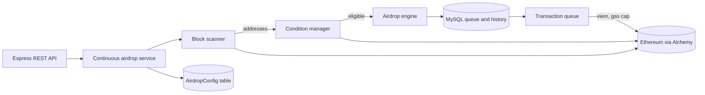

# token-airdrop-service

A continuous ERC-20 airdrop backend. It scans the latest Ethereum blocks, picks out externally-owned addresses that satisfy configurable eligibility conditions (ETH balance range, transaction-count heuristic, no previous airdrop) and sends each one a random amount of a configured token. Queue and history live in MySQL; the service is controlled through a small REST API.

> Reference code, not audited. Do not use it with real funds without your own review.

## Architecture



Flow: the service loads its config from the DB, cancels any pending transactions left over from a previous run, then loops: scan the latest block (random 50-address sample, contracts filtered out), run the eligibility condition, enqueue a transfer with a random amount, wait a random buffer period. It pauses automatically when the wallet runs low on ETH (gas) or tokens, and skips sending when gas price exceeds the configured cap.

## Stack

Node.js, TypeScript, Express 5, Prisma 6 + MySQL, viem (transfers) and ethers, alchemy-sdk, winston, zod, helmet, express-rate-limit.

## Supported chains

Ethereum mainnet and Sepolia (`NETWORK` env var), via Alchemy.

## Setup

```bash
cp .env.example .env        # fill in values
npm install
npx prisma migrate dev
npm run prisma:seed         # default AirdropConfig row
npm run dev                 # or: npm run build && npm start
```

`DRYRUN=true` runs the scanner and eligibility logic without sending transactions.

## Environment variables

| Variable | Description |
|---|---|
| `NETWORK` | `mainnet` or `sepolia` |
| `ALCHEMY_API_KEY` | Alchemy API key |
| `DISTRIBUTION_WALLET_PRIVATE_KEY` | Private key of the wallet that holds the ETH and tokens to distribute |
| `DATABASE_URL` | MySQL connection string |
| `PORT`, `NODE_ENV` | Server settings |
| `TOKEN_ADDRESS` | ERC-20 contract address to distribute |
| `TOKEN_DECIMALS` | Token decimals |
| `LOG_LEVEL` | `debug`, `info`, `warn`, `error` |
| `DRYRUN` | No transactions sent when true |
| `RATE_LIMIT_WINDOW_MS`, `RATE_LIMIT_MAX_REQUESTS` | API rate limiting |
| `PRISMA_LOG_QUERIES`, `PRISMA_LOG_INFO` | Optional Prisma logging |

Runtime parameters (ETH range, `minTokenAmount`/`maxTokenAmount`, buffer and scan intervals, retries, `maxGasPrice`) are stored in the `AirdropConfig` table and can be changed via `PUT /api/airdrop/config`.

## API surface

Base path `/api/airdrop`:

| Method | Path | Purpose |
|---|---|---|
| POST | `/start`, `/stop` | Start or stop the service |
| GET | `/status` | Service state, wallet balances, config |
| PUT | `/config` | Update runtime config |
| GET | `/history` | Paginated airdrop history and summary |
| POST | `/recover` | Recover pending transactions (service must be stopped) |
| POST | `/cleanup` | Remove duplicate pending records |
| POST | `/cleanup-stuck` | Clean up long-pending transactions |
| GET | `/recovery-stats` | Recovery statistics |

Plus `GET /health`.

## Security notes

- The API has no authentication and CORS is fully open (`cors()` with defaults). Run the service behind network-level protection (private network, VPN, firewall or an authenticating reverse proxy), and restrict CORS to known origins before exposing it anywhere.
- The distribution wallet key is read from the environment; never commit `.env`. Secret scanning is set up via `.pre-commit-config.yaml`, `.gitleaks.toml` and a GitHub workflow.

## Context

Built between mid-2025 and 2026 as a backend for distributing a custom ERC-20 token to small, organic-looking wallets. The anti-dump design (maximum ETH balance, transaction-count filter) is a simple heuristic, not a robust sybil defense. Project and token names have been neutralized (`TOKEN_*`, `TKN`).

## License

MIT, see `LICENSE`. Third-party dependencies keep their own licenses.
